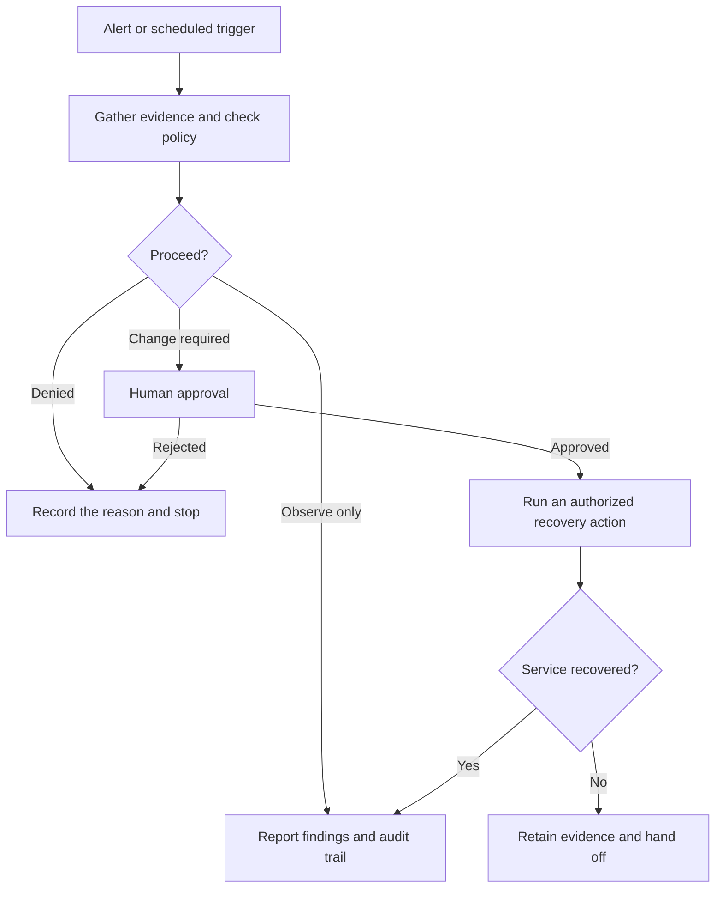

<div align="center">

**English** | [简体中文](README.zh-CN.md)


# Scry · Secure AI Operations

**Diagnose with evidence. Approve changes. Verify outcomes. Trace every action.**

Scry brings observability, an operations agent, MCP tools, and automated workflows into one web workspace for enterprise Linux and Kylin environments.

[](agent-service/)
[](agent-service/src/mcp/)
[](DEVELOPMENT_SETUP.md)
[](deploy/kylin-loong64/)
[](LICENSE)

[Why Scry](#why-scry) · [Architecture](#architecture) · [Quick start](#quick-start) · [Documentation](#documentation)

</div>

## Why Scry

Scry connects anomaly detection, diagnosis, plan review, controlled execution, and outcome verification. Use it for everyday troubleshooting, managed host operations, incident drills, and Kylin deployments.

| Operations challenge | How Scry addresses it | What you gain |
| --- | --- | --- |
| Metrics, logs, and traces are scattered across tools | Correlates services, infrastructure, messaging queues, alerts, and telemetry in one workspace | Investigate within a shared incident context |
| AI conclusions are difficult to verify | Turns tool results into evidence with sources, scores, relationships, and review controls | Inspect the facts and request a revised answer after excluding disputed evidence |
| Automated actions are difficult to constrain | Combines server-side policy, execution approval, command checks, and a restricted `scry-ops` account | Limit execution to configured hosts and actions |
| Similar incidents require repeated investigation | TopoMem retrieves experience using anomalous topology and error signatures | Start with relevant hypotheses to verify against current data |
| Effective remediation steps are hard to reuse | Visual Loops support conditions, parallel branches, iteration, approval, and verification | Save, schedule, and inspect repeatable workflows |
| Kylin and LoongArch deployments require extra integration work | Provides native build, installation, and acceptance scripts for Kylin V11 / LoongArch64 | Follow an explicit, verifiable deployment path |

### One workspace, three agent modes

| Mode | Use it to | How it works |
| --- | --- | --- |
| **Diagnose** | Investigate latency, errors, resource issues, and service outages | Prioritizes read-only evidence gathering and returns findings, supporting facts, and next steps |
| **Plan** | Define remediation steps, dependencies, risks, and verification criteria | Produces a reviewable plan before moving to operations |
| **Operate** | Run controlled actions configured by an administrator | Tools pause before execution and present an approval card; execution resumes after approval |

The agent supports persistent conversations, attachments, streaming tool status, and A2UI structured results. Model integrations support OpenAI Responses, Anthropic Messages, and endpoints compatible with those protocols.

## Architecture


- **Observability**: OpenTelemetry Collector receives telemetry; ClickHouse stores metrics, logs, and traces; the Go Query Service provides query and alert-related capabilities.
- **Agent runtime**: Node.js / Mastra coordinates model calls, MCP tools, evidence, TopoMem, and Loops. PostgreSQL and local SQLite store the corresponding runtime state.
- **Execution**: Built-in MCP tools expose schema-defined operations, with remote MCP plugins configured per organization. Host actions run through SSH and `scry-ops` wrappers.

Remote MCP plugins use separate authentication settings and do not receive the user's Scry JWT. Plugin connection failures are reported individually; agent creation fails if the built-in MCP server is unavailable.

### Evidence and memory: current facts, reusable experience


**Evidence** captures results from the current run. Users can accept, reject, suspend, select, and annotate items, then request an answer based on the selected evidence. **TopoMem** stores working, episodic, semantic, and procedural memories, with source tracking, decay, merging, archiving, and forgetting. Historical memory guides investigation; factual conclusions still require current evidence.

### Safe execution: policy, approval, and host permissions


Execution boundaries are enforced through server-side policy and host permissions: prompt injection detection, risk classification, tool argument validation, approval bound to parameters, and command checks before execution. Managed hosts use a non-root `scry-ops` account, ForceCommand, fixed wrappers, and a service allowlist. Audit events are linked by `traceId`.

Injection detection reduces risk; tool policy, approval, and host permissions jointly determine what can execute. See the [security design](docs/competition/security-design.md) and [least-privilege deployment guide](deploy/scry-ops/README.md).

### Loop: turn effective procedures into reusable workflows

Loops support manual, Cron, and event triggers, with versioning, run history, and pause/resume. This service recovery example illustrates branching and verification:



This is an example built from configurable Loop nodes; actions must be configured in advance. The repository also includes fault simulation and end-to-end evaluation tools covering databases, caches, messaging queues, networks, resource exhaustion, and compound incidents.

## Quick start

### 1. Prepare and launch the development environment

Install **Git, Docker Engine / Docker Desktop, Docker Compose v2, and Make** on the host, with access to the required image registries and dependency sources. The development stack builds from source inside containers; allow time for dependency installation and database migrations on the first run.

```bash
git clone https://github.com/xzgzszrh/Scry.git
cd Scry
cp .env.example .env
```

Edit `.env` before starting:

| Setting | What to configure |
| --- | --- |
| `SCRY_AGENT_MASTER_KEY` | Set a random master key for encrypting secrets in model, MCP, and SSH settings. Keep it stable and backed up. |
| `SCRY_POSTGRES_PASSWORD` | Replace the example password. A random hexadecimal string avoids special-character issues in the connection URL. |
| `SCRY_JWT_SECRET` | Replace the development default with a separate random secret. |

Run `openssl rand -hex 32` separately for each value. Keep the real `.env` out of version control.

```bash
make -f Makefile.dev dev
make -f Makefile.dev dev-ps
make -f Makefile.dev dev-logs
```

### 2. Open the console and connect a model and data

| Endpoint | Default address |
| --- | --- |
| Web Console | <http://localhost:3301> |
| Query Service health check | <http://localhost:8080/api/v1/health> |
| Agent Service health check | <http://localhost:4111/health> |
| MCP Streamable HTTP | `http://localhost:4111/mcp` — authenticated protocol endpoint |
| OTLP ingestion | gRPC `127.0.0.1:4317` / HTTP `http://127.0.0.1:4318` |

1. Complete initial account setup in the console and sign in.
2. Open **Settings → Tools & Security → Model settings** (`设置 → 工具与安全 → 模型设置`), configure the model, endpoint, and API key, then test and save the connection.
3. Connect OpenTelemetry data. To try a simulated incident, enable a scenario under **Settings → Debug mode** (`设置 → 调试模式`).
4. Open **Agent Workspace**, select **Diagnose**, and describe the issue.

> Try: **“Investigate the increase in checkout service errors over the last 15 minutes. Start with a plan, then use logs and traces to verify the root cause.”** Replace `checkout` with a service that exists in your environment.

Development ports bind to `127.0.0.1` by default. Before production deployment, disable debug simulation, configure access, and follow the [user manual](docs/competition/03-software-product-manual.md) for host enrollment and permissions.

<details>
<summary>Common development commands and troubleshooting</summary>

```bash
# Restart services running from source
make -f Makefile.dev dev-backend-restart
make -f Makefile.dev dev-agent-restart

# Stop the development stack while retaining named data volumes
make -f Makefile.dev dev-down

# Agent checks, tests, and build (host-based development needs Node.js >= 22.13.0)
cd agent-service
npm ci
npm run typecheck
npm test
npm run build
```

If the console is unavailable, inspect `dev-ps` and `dev-logs` for dependency installation, migration, and health-check status. For model connection failures, check the endpoint protocol, model ID, credentials, and network. See the [development guide](DEVELOPMENT_SETUP.md) for details.

</details>

## Kylin V11 / LoongArch64 deployment

The native deployment path uses Go / CGO for Query Service, Node.js for Agent Service, Nginx for the frontend, and systemd for service management. Prepare PostgreSQL, ClickHouse, the required build toolchain, and dependency access on the target host, then configure `platform.env`.

After preparing Node.js, the database, and the master key as described in the [Kylin deployment guide](deploy/kylin-loong64/README.md), run on the target host:

```bash
cd deploy/kylin-loong64
./preflight.sh
./build-query.sh
./build-agent.sh
./build-frontend.sh
sudo ./install-native.sh
sudo ./acceptance.sh
```

Use `./deploy/kylin-loong64/package-release.sh` to create a compact source distribution. Deployment readiness is determined by the target host's preflight and acceptance results.

## Documentation

The detailed guides and reports linked below are currently in Simplified Chinese.

| Learn about | Start here |
| --- | --- |
| Product features and usage | [Feature specification](docs/competition/product-functional-specification.md) · [User manual](docs/competition/03-software-product-manual.md) |
| Architecture and design | [Functional design](docs/competition/02-software-functional-design.md) · [Technical architecture PDF](docs/scry-technical-architecture/scry-technical-architecture.pdf) |
| Evidence, security, and execution boundaries | [Evidence system](docs/competition/evidence-system.md) · [Security design](docs/competition/security-design.md) · [scry-ops](deploy/scry-ops/README.md) |
| Development and native deployment | [Development setup](DEVELOPMENT_SETUP.md) · [Kylin / LoongArch64](deploy/kylin-loong64/README.md) |
| Testing and evaluation | [Test and acceptance plan](docs/competition/test-and-acceptance-plan.md) · [Functional test report](docs/competition/04-software-functional-test-report.md) · [Performance report](docs/competition/05-software-performance-core-metrics-test-report.md) |
| Competition materials and implementation scope | [Submission overview](docs/competition/README.md) · [Compliance matrix](docs/competition/compliance-matrix.md) · [Development scope](docs/competition/development-scope.md) |

<details>
<summary>Source guide</summary>

| Path | Contents |
| --- | --- |
| [`frontend/`](frontend/) | React Web Console, Agent Workspace, memory and Loop management |
| [`agent-service/`](agent-service/) | Model integrations, MCP, evidence, TopoMem, security policy, and workflows |
| [`pkg/query-service/`](pkg/query-service/) | Go query service, telemetry, alerts, and fault simulation |
| [`deploy/scry-ops/`](deploy/scry-ops/) | Least-privilege SSH execution environment |
| [`deploy/kylin-loong64/`](deploy/kylin-loong64/) | Native Kylin builds, installation, packaging, and acceptance |
| [`docs/`](docs/) | Product, design, testing, and delivery documentation |

</details>

## Maintenance and feedback

Maintained by [@xzgzszrh](https://github.com/xzgzszrh). Use [Issues](https://github.com/xzgzszrh/Scry/issues) for bug reports and suggestions, including reproduction steps, deployment details, and redacted logs. For security concerns, see [SECURITY.md](SECURITY.md).

## Licensing and third-party sources

Scry extends SigNoz observability query and interface code and integrates components including OpenTelemetry, ClickHouse, PostgreSQL, and Mastra. See the [development scope](docs/competition/development-scope.md) for the boundaries between Scry modules and third-party code.

Licensing follows the root [LICENSE](LICENSE), [`ee/LICENSE`](ee/LICENSE), and each third-party component's license. Preserve the required copyright and license notices when distributing source or deployment packages. README illustrations describe capabilities implemented in the repository.
