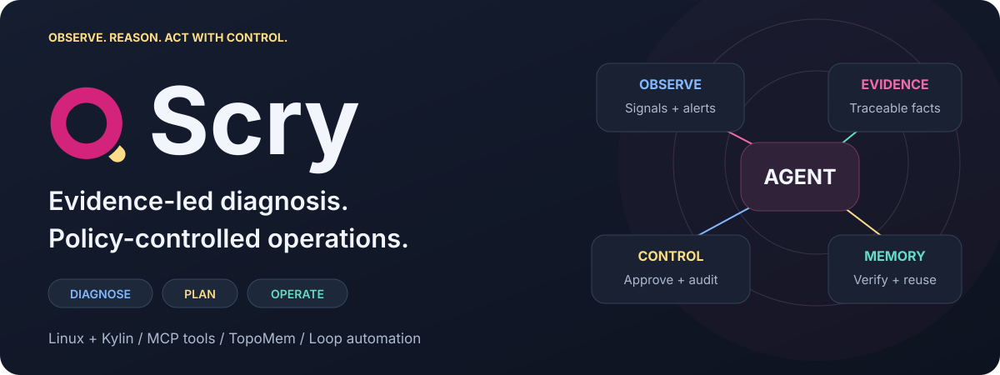
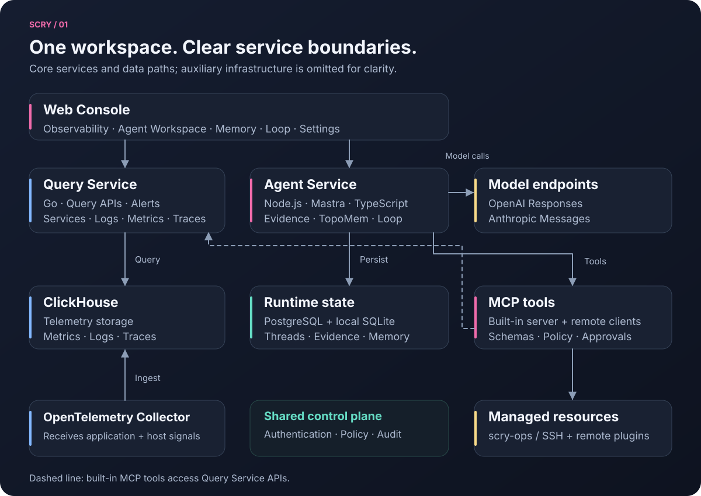
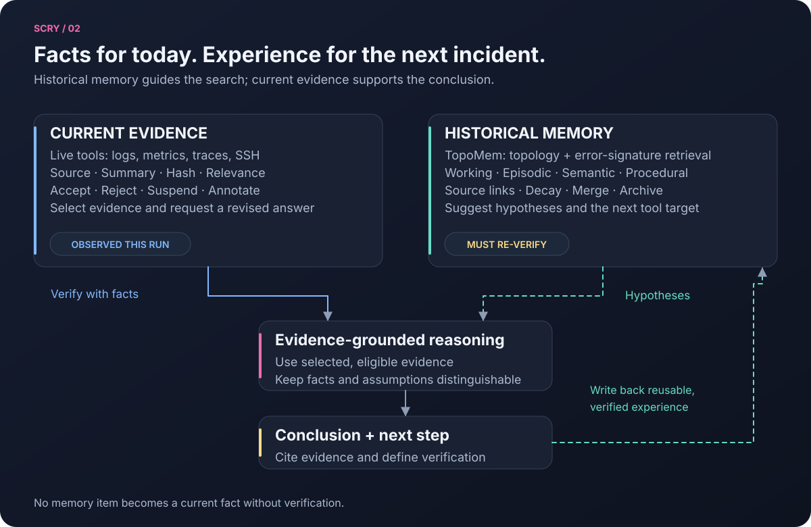
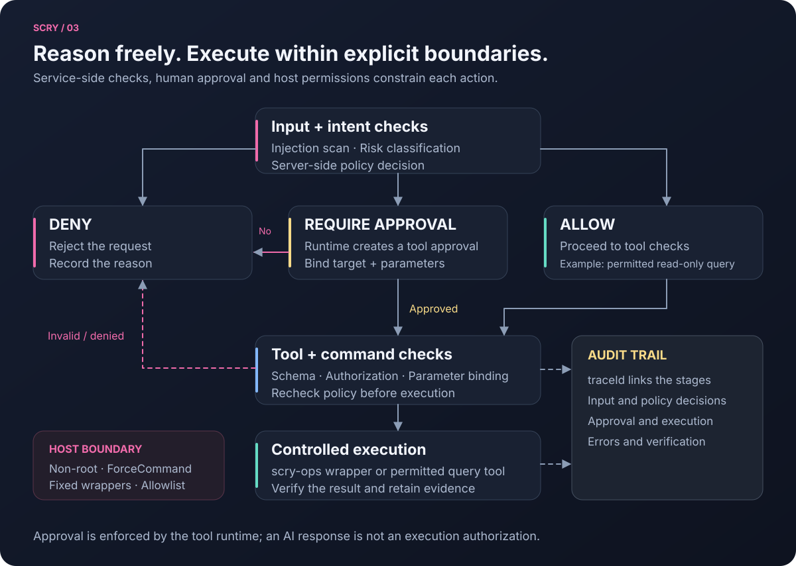
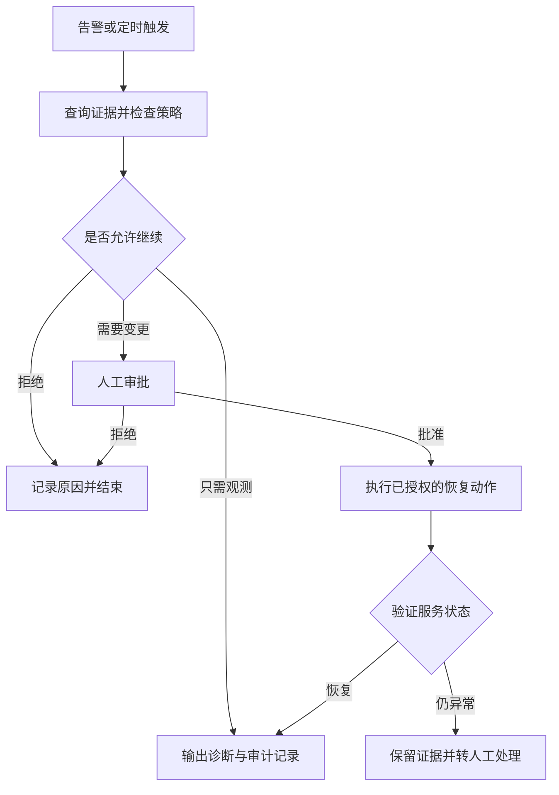

<div align="center">



# Scry · 安全智能运维平台

**让每一次故障诊断有证据，让每一次运维操作可审批、可验证、可追溯。**

BoringPanel 是 Scry 的源码仓库。面向企业 Linux 与麒麟环境，将可观测数据、运维 Agent、MCP 工具和自动化流程整合到一个 Web 工作台。

[](agent-service/)
[](agent-service/src/mcp/)
[](DEVELOPMENT_SETUP.md)
[](deploy/kylin-loong64/)
[](LICENSE)

[为什么选择 Scry](#为什么选择-scry) · [系统架构](#系统架构) · [快速开始](#快速开始) · [文档导航](#文档导航)

</div>

## 为什么选择 Scry

Scry 把“发现异常、定位原因、审查方案、执行操作、验证结果”连接起来，适合日常排障、受控主机运维、故障演练与麒麟环境交付。

| 运维中的难题 | Scry 的做法 | 带来的价值 |
| --- | --- | --- |
| 指标、日志、链路分散，定位时反复切换 | 在同一工作台关联服务、基础设施、消息队列、告警与遥测 | 围绕同一个故障上下文取证 |
| AI 给出判断，却难以核查依据 | 工具结果形成证据，提供来源、评分、关系与人工处置 | 结论可核查，争议证据可排除后重答 |
| 自动化操作的权限与风险难控制 | 服务端策略、执行审批、命令复检与 `scry-ops` 受限账户 | 将操作限制在预先配置的主机与动作内 |
| 同类故障重复排查，经验散落在聊天记录 | TopoMem 按异常拓扑、错误签名与历史经验检索 | 为本次诊断提供待验证的线索 |
| 有效处置步骤难以复用 | 可视化 Loop，支持条件、并行、循环、审批与验证 | 将重复流程保存、调度并查看运行历史 |
| 国产平台交付需要额外适配 | 麒麟 V11 / LoongArch64 原生构建、安装与验收脚本 | 提供可检查的部署路径 |

### 一个工作台，三种 Agent 模式

| 模式 | 适合做什么 | 交互方式 |
| --- | --- | --- |
| **诊断** | 排查延迟、错误、资源异常与服务不可用 | 优先只读取证，给出结论、依据与下一步 |
| **规划** | 形成处置步骤、依赖、风险与验证条件 | 先审查计划，再决定是否进入操作 |
| **操作** | 执行管理员已配置的受控动作 | 工具在执行前暂停并生成审批卡，批准后继续 |

Agent 支持持久对话、附件、流式工具状态与 A2UI 结构化结果；模型适配 OpenAI Responses、Anthropic Messages 及对应协议的兼容端点。

## 系统架构



- **观测层**：OpenTelemetry Collector 接收遥测，ClickHouse 存储指标、日志与链路，Go Query Service 提供查询与告警相关能力。
- **智能层**：Node.js / Mastra Agent 组织模型推理、MCP 工具、证据、TopoMem 与 Loop；PostgreSQL 和本地 SQLite 承担对应的运行状态存储。
- **执行层**：内置 MCP 暴露有 Schema 的运维工具，可按组织接入远程 MCP；主机操作通过 SSH 与 `scry-ops` 包装器执行。

远程 MCP 插件使用独立认证配置，不接收用户的 Scry JWT。插件连接失败会单独报告；内置 MCP 不可用时，Agent 创建失败。

### 证据与记忆：当前事实和历史经验各司其职



**证据**记录本轮工具结果，支持接受、驳回、挂起、选择和备注；选择证据后可要求 Agent 基于所选材料重新回答。**TopoMem**保存工作、情景、语义和程序记忆，支持来源追踪、衰减、合并、归档与遗忘。历史记忆用于指导查询，事实结论仍需本轮证据验证。

### 安全执行：策略、审批与主机权限共同约束



安全边界落实在服务端策略和主机权限中：输入注入检测、风险分类、工具参数校验、审批参数绑定，以及执行前命令复检。受管主机使用非 root 的 `scry-ops` 账户、ForceCommand、固定包装器与服务白名单；审计事件通过 `traceId` 关联。

注入检测用于降低风险，实际执行范围仍由工具策略、审批和主机权限共同决定。配置方式见 [安全设计](docs/competition/security-design.md) 与 [最小权限执行部署](deploy/scry-ops/README.md)。

### Loop：把有效的处理步骤变成可复用流程

Loop 支持手动、Cron 与事件触发，提供版本、运行记录及暂停恢复。下面以服务恢复为例说明分支与验证关系：



流程示意对应可配置的 Loop 节点，具体动作需事先配置。另提供故障模拟与端到端评测工具，覆盖数据库、缓存、消息队列、网络、资源与复合故障，便于演示和验证诊断流程。

## 快速开始

### 1. 准备并启动开发环境

宿主机需要 **Git、Docker Engine / Docker Desktop、Docker Compose v2 与 Make**，并能访问所需镜像及依赖源。默认开发环境在容器内编译源码，首次启动需要等待依赖安装与数据库迁移。

```bash
git clone https://github.com/xzgzszrh/BoringPanel.git
cd BoringPanel
cp .env.example .env
```

启动前编辑 `.env`：

| 配置项 | 应如何设置 |
| --- | --- |
| `SCRY_AGENT_MASTER_KEY` | 填入随机主密钥，用于加密模型、MCP 与 SSH 等配置中的秘密；后续保持稳定并妥善备份 |
| `SCRY_POSTGRES_PASSWORD` | 替换示例密码；建议使用随机十六进制字符串，避免连接 URL 中的特殊字符问题 |
| `SCRY_JWT_SECRET` | 替换开发默认值，设置为独立的随机秘密 |

可使用 `openssl rand -hex 32` 分别生成这些值，不要提交真实 `.env`。

```bash
make -f Makefile.dev dev
make -f Makefile.dev dev-ps
make -f Makefile.dev dev-logs
```

### 2. 打开控制台，接入模型与数据

| 入口 | 默认地址 |
| --- | --- |
| Web Console | <http://localhost:3301> |
| Query Service 健康检查 | <http://localhost:8080/api/v1/health> |
| Agent Service 健康检查 | <http://localhost:4111/health> |
| MCP Streamable HTTP 端点 | `http://localhost:4111/mcp`（需认证的协议端点） |
| OTLP 接收 | gRPC `127.0.0.1:4317` / HTTP `http://127.0.0.1:4318` |

1. 在控制台完成首次账号配置并登录。
2. 进入 **设置 → 工具与安全 → 模型设置**，填写模型、端点与 API Key，测试连接并保存。
3. 接入 OpenTelemetry 数据；体验诊断时，也可在 **设置 → 调试模式** 启用模拟场景。
4. 打开 **Agent Workspace**，选择诊断模式，开始询问。

> 试一试：**“排查最近 15 分钟 checkout 服务的错误率上升，先给出计划，再用日志和链路验证根因。”** 将 `checkout` 替换为环境中实际存在的服务。

开发端口默认只绑定 `127.0.0.1`。正式部署前应关闭调试模拟、配置访问入口，并按 [用户手册](docs/competition/03-software-product-manual.md) 完成主机纳管与权限配置。

<details>
<summary>常用开发命令与排查入口</summary>

```bash
# 重启源码服务
make -f Makefile.dev dev-backend-restart
make -f Makefile.dev dev-agent-restart

# 停止开发环境，保留命名数据卷
make -f Makefile.dev dev-down

# Agent 静态检查、测试与构建（宿主机单独开发需 Node.js >= 22.13.0）
cd agent-service
npm ci
npm run typecheck
npm test
npm run build
```

页面暂不可用时，先查看 `dev-ps` 与 `dev-logs`，确认依赖安装、迁移与服务健康状态。模型连接失败时检查端点协议、模型 ID、凭证与网络。更多说明见 [开发环境文档](DEVELOPMENT_SETUP.md)。

</details>

## 麒麟 V11 / LoongArch64 部署

仓库提供原生构建路径：Go / CGO 编译 Query Service，Node.js 运行 Agent，Nginx 托管前端，systemd 管理服务。目标机需要准备 PostgreSQL、ClickHouse、编译工具链与网络依赖，修改 `platform.env` 中的部署配置。

按 [麒麟部署说明](deploy/kylin-loong64/README.md) 完成 Node.js、数据库与主密钥准备后，在目标机执行：

```bash
cd deploy/kylin-loong64
./preflight.sh
./build-query.sh
./build-agent.sh
./build-frontend.sh
sudo ./install-native.sh
sudo ./acceptance.sh
```

可通过 `./deploy/kylin-loong64/package-release.sh` 生成精简源码交付包。实际部署结果以目标机预检与验收输出为准。

## 文档导航

| 我想了解… | 从这里开始 |
| --- | --- |
| 产品功能与使用方法 | [功能说明](docs/competition/product-functional-specification.md) · [用户手册](docs/competition/03-software-product-manual.md) |
| 架构与设计 | [功能设计](docs/competition/02-software-functional-design.md) · [技术架构 PDF](docs/scry-technical-architecture/scry-technical-architecture.pdf) |
| 证据、安全与执行边界 | [证据系统](docs/competition/evidence-system.md) · [安全设计](docs/competition/security-design.md) · [scry-ops](deploy/scry-ops/README.md) |
| 本地开发与原生部署 | [开发环境](DEVELOPMENT_SETUP.md) · [麒麟 / LoongArch64](deploy/kylin-loong64/README.md) |
| 测试与评测 | [测试与验收计划](docs/competition/test-and-acceptance-plan.md) · [功能测试报告](docs/competition/04-software-functional-test-report.md) · [性能报告](docs/competition/05-software-performance-core-metrics-test-report.md) |
| 比赛材料与实现范围 | [提交文档总览](docs/competition/README.md) · [符合性矩阵](docs/competition/compliance-matrix.md) · [开发边界](docs/competition/development-scope.md) |

<details>
<summary>源码导览</summary>

| 路径 | 主要内容 |
| --- | --- |
| [`frontend/`](frontend/) | React Web Console、Agent 工作区、记忆与 Loop 管理 |
| [`agent-service/`](agent-service/) | 模型适配、MCP、证据、TopoMem、安全策略与工作流 |
| [`pkg/query-service/`](pkg/query-service/) | Go 查询服务、遥测、告警与故障模拟 |
| [`deploy/scry-ops/`](deploy/scry-ops/) | 最小权限 SSH 执行环境 |
| [`deploy/kylin-loong64/`](deploy/kylin-loong64/) | 麒麟原生构建、安装、打包与验收 |
| [`docs/`](docs/) | 产品、设计、测试与交付材料 |

</details>

## 维护与反馈

当前仓库由 [@xzgzszrh](https://github.com/xzgzszrh) 维护。欢迎通过 [Issues](https://github.com/xzgzszrh/BoringPanel/issues) 提交问题与建议，请附上复现步骤、部署环境及脱敏后的日志；安全问题请参阅 [SECURITY.md](SECURITY.md)。

## 许可证与第三方来源

Scry 基于 SigNoz 的可观测查询与界面基础代码扩展，集成 OpenTelemetry、ClickHouse、PostgreSQL、Mastra 等组件；自主实现模块与第三方范围见 [开发边界说明](docs/competition/development-scope.md)。

许可适用范围以根目录 [LICENSE](LICENSE)、[`ee/LICENSE`](ee/LICENSE) 及各第三方组件许可证为准。分发源码或部署包时，应保留要求保留的版权和许可声明。README 配图为依据仓库实现绘制的功能示意图。
